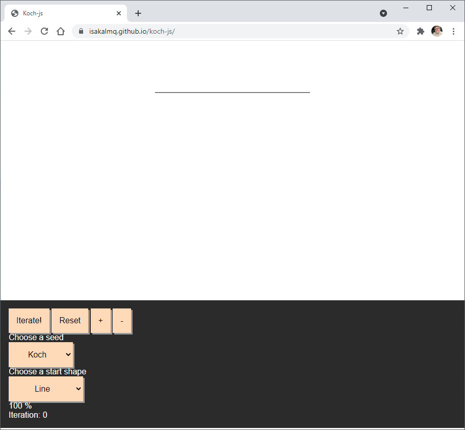
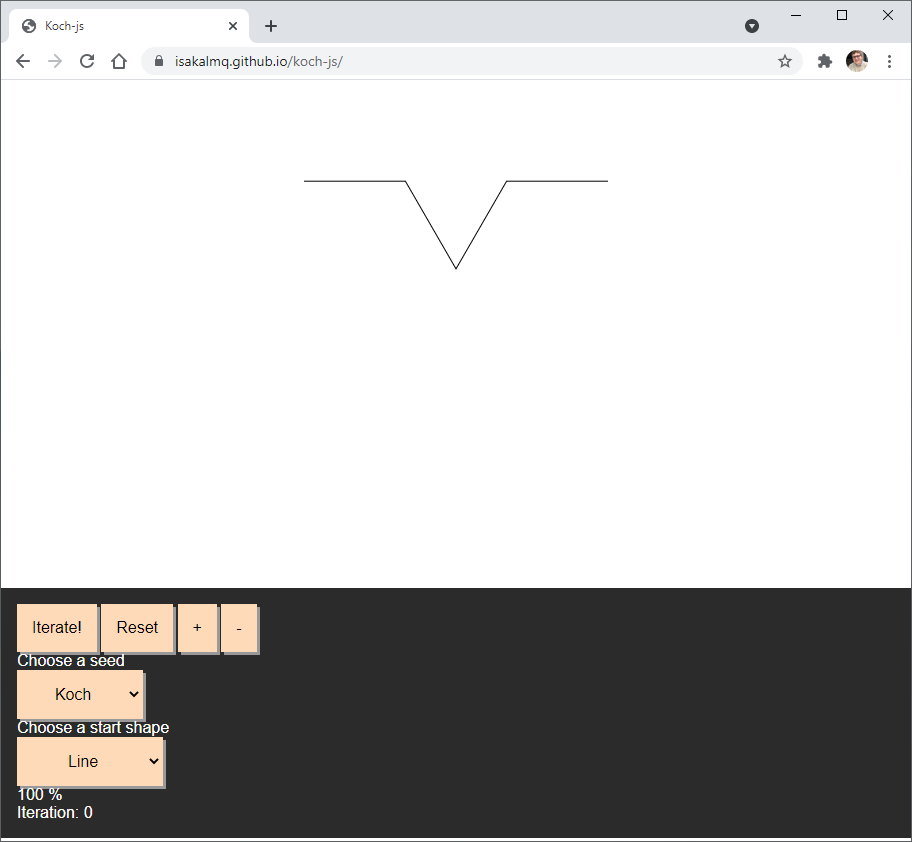

# koch-js
A web application written in vanilla JavaScript, HTML and CSS that generates and displays fractal curves on a HTML canvas. Can be viewed [here](https://isakalmq.github.io/koch-js/).

Read more about [fractals](https://en.wikipedia.org/wiki/Fractal) and [koch curves](https://en.wikipedia.org/wiki/Koch_snowflake).

# Usage
Open the app: [isakalmq.github.io/koch-js/](https://isakalmq.github.io/koch-js/).
Works on both mobile and desktop. 

## Iterations
The iterate button displays the next iteration of the fractal, as can be seen in the following two images. 

||
|:---:|
|Before pressing the iterate button|

||
|:---:|
|After pressing the iterate button|

## Controls
The plus and minus buttons allow the user to zoom in and out. The figure can also be zoomed using pinch gestures or the scroll wheel. The figure can be panned using mouse or touch.

## Staring shape and seed
The drop down menus allow the user to change the starting shape (Start shape) and the figure replacing the lines in the starting shape (Seed). The reset button resets the figure to the starting shape.

||
|:---:|
|After selecting "Square" as the starting shape|